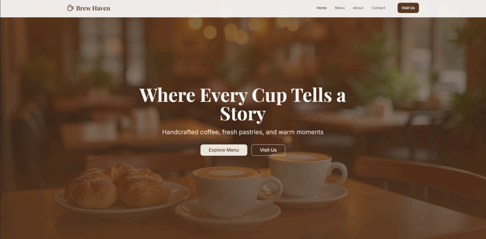

# ☕ Brew Haven – Café Website 

## Overview
**Brew Haven** is a minimalist and inviting café website concept designed to reflect the warm and cozy atmosphere of the café itself. The design focuses on creating a seamless browsing experience for customers while highlighting the brand’s charm, products, and welcoming ambiance. 

## Design Description
The layout is clean and visually balanced, combining **earthy tones**, **soft typography**, and **high-quality imagery** that evoke a comforting café experience. The design emphasizes simplicity, user-friendliness, and warmth — making visitors feel at home from the moment they land on the page.

### Key Visual Elements
- **Color Palette:** Warm browns, creams, and neutral tones that resemble brewed coffee and pastries, enhancing the café’s inviting identity.  
- **Typography:** Elegant yet readable fonts that match the artisanal and cozy theme of Brew Haven.  
- **Navigation Bar:** A simple top navigation that directs users to key sections — such as *Home*, *Menu*, *About*, and *Contact* — ensuring intuitive browsing.  
- **Product/Menu Section:** Visually appealing product cards featuring images of best-selling drinks and pastries.  
- **About Section:** Brief text area that introduces the café’s story, values, and commitment to quality.  
- **Contact Page:** Includes a form for inquiries, business information (location, phone, email), and social media links, complemented by a placeholder for map integration.  
- **Footer:** Clean and consistent, containing essential contact details, business hours, and quick links.

## Tools Used
- **Design Tool:** Figma 
- **Design Type:** Web UI Mockup  
- **Focus:** Visual identity, layout consistency, and user-friendly interaction flow.  

## 🎨 Figma Design
You can view the Figma prototype here:  
👉 [View Figma Design](https://www.figma.com/design/sUSOymoTbdCk2ILquBDmn0/POS?node-id=0-1&t=7QQI4VHYlZ6HWg20-1)

## Credits
Designed by **Elisha Jhoyce Magbitang**  
© 2025 Brew Haven. All rights reserved.

